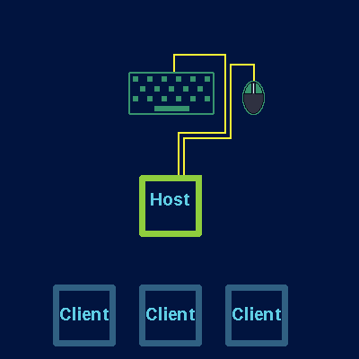

# Mimikey – One Keyboard, One Mouse, Multiple Computers. #  

## What Does Mimikey Do? ##  

_Mimikey_ allows you to forward keyboard and mouse input to other computers. It's almost as if you're changing which computer those peripherals are plugged into.  

---

## How To Use ##

Once installed, run either the host.py or client.py  program, depending on if you want to forward inputs from that computer or receive forwarded inputs, respectively.  
The client(s) and host should automatically find and connect to each other.  
Once connected, you can cycle through which computer receives input from the host by pressing a hotkey (F11 by default).

---

## How To Install ## 

To install _Mimikey_, you can clone this git project using the following command: 
`git clone https://github.com/davis-b/mimikey`  

Alternatively, you can [download the project](https://github.com/davis-b/mimikey/archive/refs/heads/master.zip) directly from github as a zipped file.  

Perhaps in the future, a simple `pip` call could be used.  

---

## Requirements and Dependencies ##

_Mimikey_ works on Windows and Linux.  
On Linux, both X11 and the [python xlib](https://github.com/python-xlib/python-xlib) library are required.  

The following python modules are required:  
* [mal](https://github.com/davis-b/mal) –
Minimal Automation Library; used to inject input on client machines.
* [keywatch](https://github.com/davis-b/keywatch) –
Grabs and records keyboard and mouse input on the host machine.
* [keynames](https://github.com/davis-b/keynames) –
Contains keycode information. Used for translating between Windows and Linux keypresses.

Other than that, the only requirements are Python3 and a shared network connection between the computers you wish to connect.

---

## How It Works ## 

_Mimikey_ works by forwarding input from one _host_ computer to one of many potential _client_ computers.

A _Mimikey_ host works by actively grabbing keyboard and mouse[^1] input, before it gets sent to other programs.
Then, it sends the input information – such as keycodes and mouse movements – to whichever client is set to be receiving them. If no client is set to receive input, _Mimikey_ will ungrab the peripherals, allowing the host to use them as usual.

A _Mimikey_ client receives inputs from the host and emulates them in software.  
This does have a limitation of not working in circumstances where a program does not accept "injected" input, such as when Administrator privileges are requested in Windows, or in some games.  

[^1]: On Linux, _Mimikey_ mouse 'grabbing' is currently limited to buttons, and not cursor movement. Thus, we emulate an active grab of cursor movement by keeping it inside a small area via repeated [warping](https://www.x.org/releases/X11R7.6/doc/man/man3/XWarpPointer.3.xhtml).

---

### Notes ###

This concept could be greatly improved if we were able to execute a client program as the computer starts, before a user logs in. A user will still need to shift around USB devices or have multiple keyboards in order to log in to each computer.  

If we injected input at a lower level, perhaps even emulating hardware, that would provide a better user experience.

As we are only forwarding inputs, differences in monitor sizes or orientation between the host and client do not affect the user experience of _Mimikey_.   

---